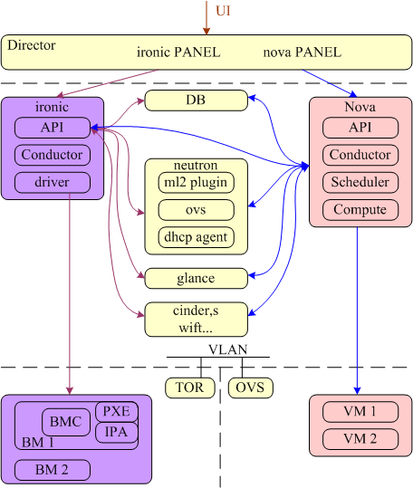
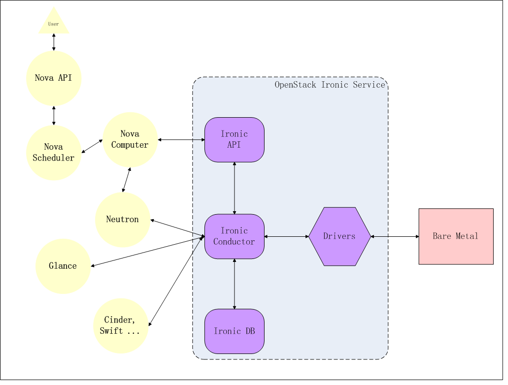
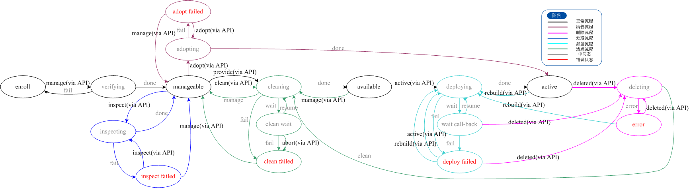

# ironic 简介

ironic基于openstack工程，与keystone，nova，neutron，glance以及可能的swift和cinder协作，共同完成裸金属的部署和管理。在配置了计算和网络服务之后，通过nova api，可以将裸机和虚机进行相似的管理，但由于部分功能会受到硬件条件的限制，比如动态迁移。

社区通过开源技术，主要是 PXE 和 IPMI，来实现大部分硬件的统一管理，也允许各供应商发布自己的硬件驱动。

## ironic与openstack各组件架构

ironi与openstack各组件架构图，对比nova部署裸机，显示了ironic与各组件的关系。通过各组件提供的服务，以及ironic的关键技术，共同完成了裸机部署功能。

## 逻辑图

逻辑图显示了ironic的基础组件，与其他openstack服务之间的联系和逻辑上的部署裸机的流程

ironic包含以下组件：

1、一个RESETful API服务，管理员和其他服务通过这个API调用ironic服务。

2、一个Conductor服务，执行ironic的主要功能，与API通过RPC通讯。

3、一个消息队列。

4、一个数据库，用于存储资源信息，包含conductor的状态，节点（物理服务器）状态，以及驱动信息。

## ironic部署调用各组件流程

ironic部署步骤的社区图如图所示，详细的部署时序和流程详见《部署流程》章节。

## ironic 状态机

ironic的状态机示意图，按照正常的裸机部署流程，节点状态经历enroll->manageable->available->active，启动一个裸机。中间可能衍生的其他的流程已经由不同的颜色标出，具体的各个状态的切换以及操作流程在后续的各个特性和用户文档中详细说明。这里仅做一个总体上的了解和查阅。