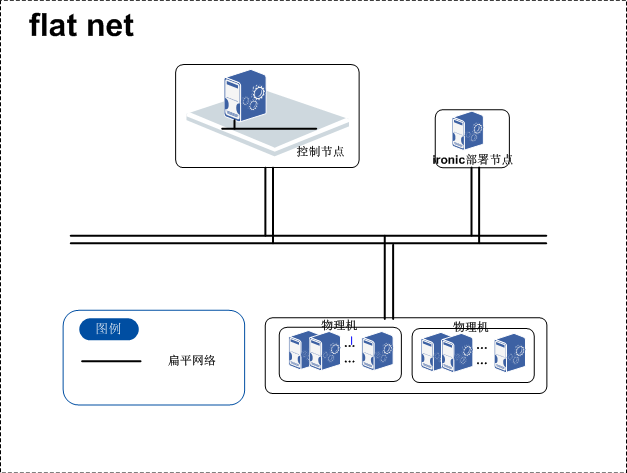
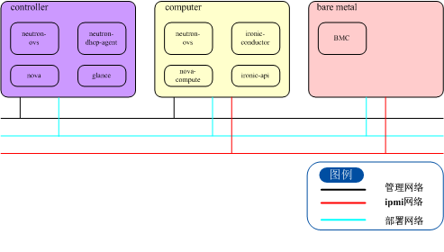

# ironic部署flat网络场景

本节描述ironic在flat环境的部署场景。

## 场景概述

目前ironic设置允许3种网络：

noop：用于ironic独立部署，不需要任何网络切换。

flat：将所有的部署完成的节点和待部署的节点都放在一个单独的二层网络之中，从清除网络隔离。

neutron：结合网络服务，提供指定的租户网络，并将租户网络与部署、清除网络隔离。

flat网络即所有部署完成节点和待部署的节点都在一个扁平网络内。在neutron建立一个单一网络，保证在这个网络内，控制节点，ironic部署节点能够联通。有新的裸机时，将裸机也接入这个网络，部署后也不脱离。

flat网络结构简单，部署方便，但是由于所有裸机和管理机在同一个网络内，没有隔离，安全性不高。适合快速搭建基础环境，或小集群要求。

## 物理节点框架

## 服务组件分布

## 网络平面

flat网络的组网简单。除节点的管理网络之外，将裸机的可以从pxe启动的网口、计算节点的tftp网口、控制节点的dhcp网口配置在同一网络内即可。可以是通过交换机直接连接，也可以在交换机上配置同一vlan，由管理员和现场施工网络专家完成。另外，计算节点需要能够连接裸机的ipmi网络。

## ironic物理环境分配

#### 部署节点列表

对于一套网络组，至少需要一套控制节点与计算节点，如果需要HA，则需要两台互为主备。

| 节点类型                 | 节点数  | 节点规格 | 说明       |          |      |      |      |
| -------------------- | ---- | ---- | -------- | -------- | ---- | ---- | ---- |
| 核数                   | 内存   | 网口数  | 系统盘  （G） | 数据盘  （G） |      |      |      |
| OpenStack ironic部署节点 | 2    | 8    | 32       | 4        | 200  | 900  |      |
| OpenStack控制节点        | 2    | 8    | 32       | 6        | 200  | 900  |      |

注： 

1、openstack ironic部署节点

（1）代理节点采用HA，每POD使用2台VM

（2）按POD扩展，每增加1个POD（50台服务器），增加OpenStack代理节点4Core/16G

（3）代理节点采用Scale Out水平扩展

2、openstack控制节点

（1）该资源池需配置2个控制节点

（2）按POD扩展，每增加5POD，增加OpenStack控制节点8Core/32G。

（3）控制节点采用Scale Up垂直扩展，当VM规格超出服务器上限时采用Scale Out增加控制节点扩展。

## 运维流程（用户操作）

运维流程可以分为以下几步：

1. 准备设备的物理环境，请参考 ironic 安装文档。
2. 将裸机加入组网，注册节点，请参考裸机注册文档。
3. 管理员执行inspect操作，请参考裸机发现文档。
4. 执行部署操作，请参考裸机部署文档。