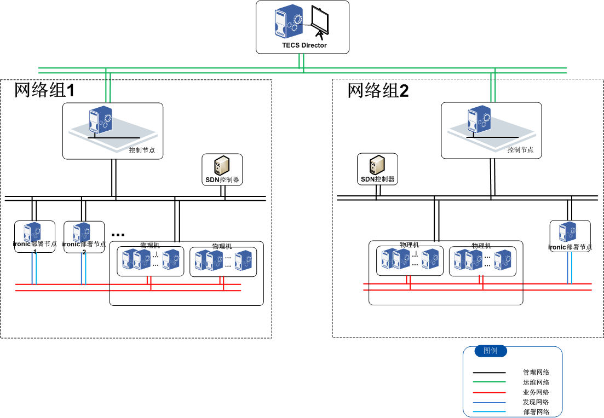
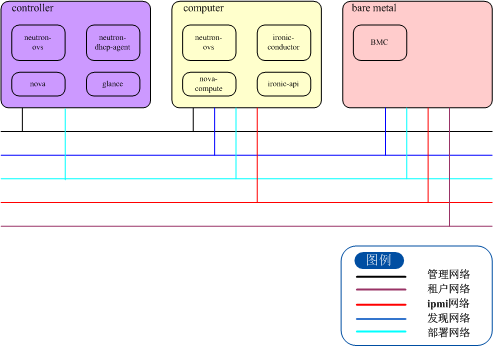
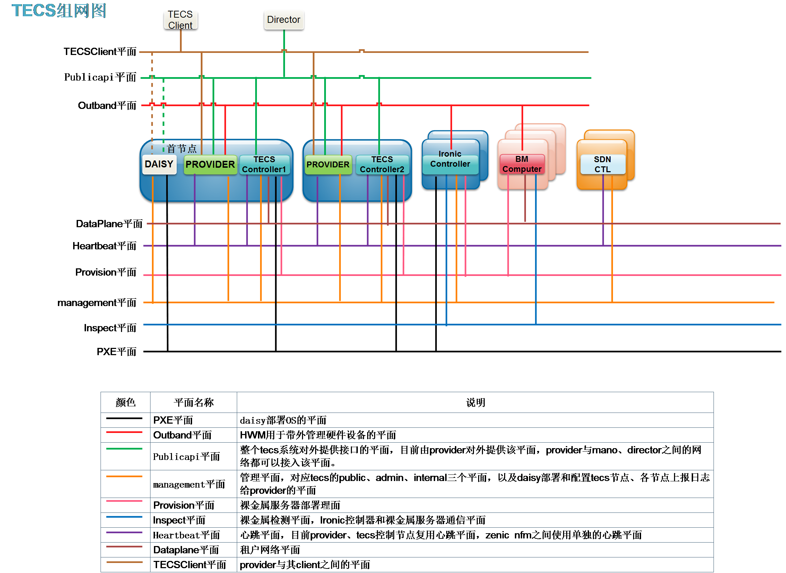
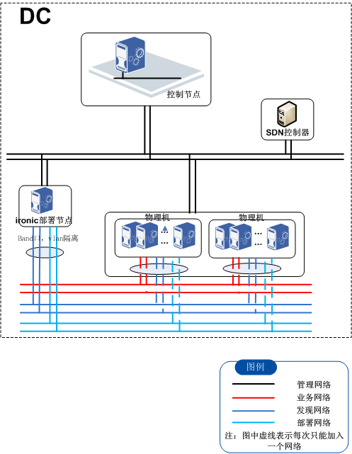
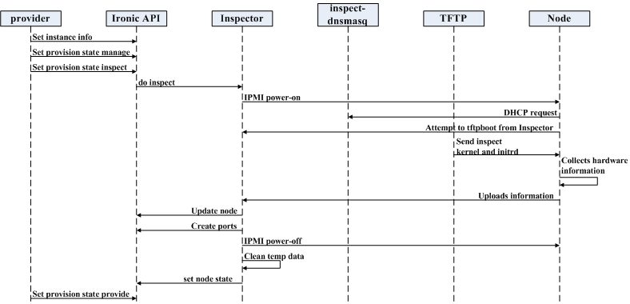
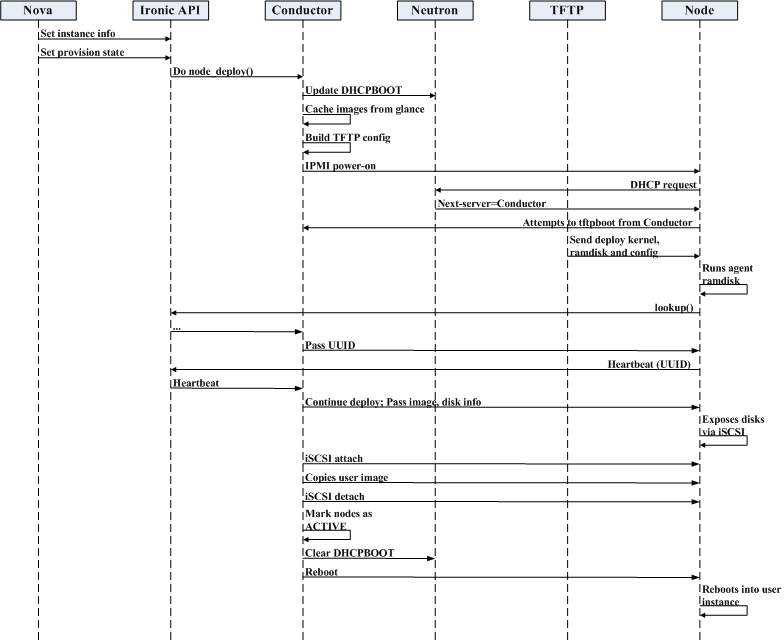
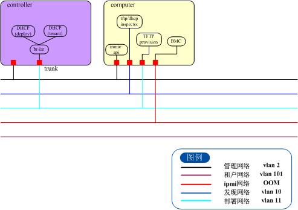
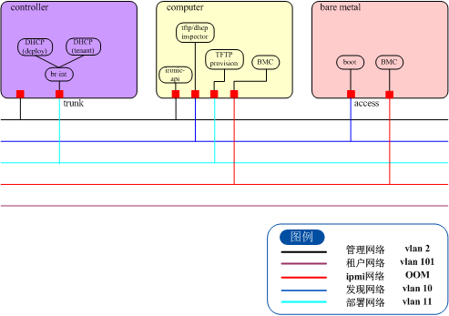
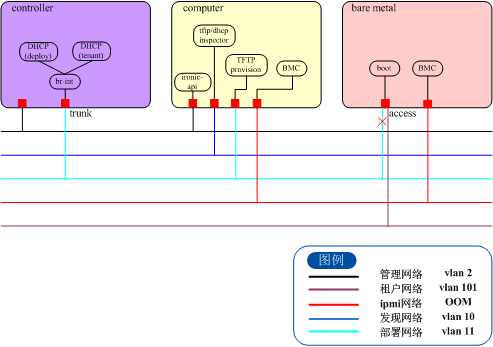

# ironic部署vlan网络场景上下文

## 术语

| 术语定义     | 英文                                       | 说明             |
| -------- | ---------------------------------------- | -------------- |
| provider |                                          | 硬件管理界面         |
| ironic   |                                          | 裸机部署服务         |
| PXE      | Preboot Execution Environment            | 预启动执行环境        |
| IPMI     | Intelligent Platform Management Interface | 智能平台管理接口       |
| TFTP     | Trivial File Transfer Protocol           | 简单文件传输协议文件传输协议 |
| DHCP     | Dynamic Host Configuration Protocol      | 动态主机设定协定       |
| VLAN     | Virtual Local Area Network               | 虚拟局域网          |
| TECS     | Tulip Elastic Cloud System               | 郁金香弹性云系统       |

## 概述

ironic裸金属管理服务，主要基于TECS云平台管理组件TECS Director、TECS OpenStack，提供大集群裸机的统一部署和管理的解决方案。通过openstack-ironic组件来替代传统的手工部署模式。

openstack社区版的ironic从Ocata版本开始支持vlan网络部署。适用于大部分有物理交换机的实际商用环境，通过网络翻转，可以实现裸机在部署网络和租户网络之间的切换。

本上下文根据ironic在vlan网络下的部署场景，主要描述：ironic的基本介绍、系统架构、在vlan网络模型下的裸机发现，部署、删除等功能，以及实际用户现场操作运维流程。

## ironic基本介绍

ironic基于openstack工程，与keystone，nova，neutron，glance以及可能的swift和cinder协作，共同完成裸金属的部署和管理。在配置了计算和网络服务之后，通过nova api，可以将裸机和虚机进行相似的管理，但由于部分功能会受到硬件条件的限制，比如动态迁移。

社区通过开源技术，主要是PXE和IPMI，来实现大部分硬件的统一管理，也允许各供应商发布自己的硬件驱动。

### 使用ironic的好处

ironic通过部署和管理物理机，能够处理许多一般虚机无法完成的场景，包括但不限于以下情况：

1、通过ironic部署和管理物理机，将部分需要高性能的服务放到物理机上，以提高云计算性能。

2、部分与硬件有联系的计算任务，在现有技术条件下难以虚拟化的，通过ironic可以在物理机上提供。

3、大规模数据库管理，部分数据库在虚拟层性能不佳。

4、能够方便地创建一个专用的节点，提供给单租户、特性硬件或安全、可靠性等调控需求。

5、快速部署一个云环境所需的基础设施。

### ironic与openstack各组件架构

ironic包含以下组件：

1、一个RESETful API服务，管理员和其他服务通过这个API调用ironic服务。

2、一个Conductor服务，执行ironic的主要功能，与API通过RPC通讯。

3、一个消息队列。

4、一个数据库，用于存储资源信息，包含conductor的状态，节点（物理服务器）状态，以及驱动信息。

### 逻辑图

### ironic部署调用各组件流程

ironic部署步骤的社区图如图所示，详细的部署时序和流程详见《部署流程》章节。

### ironic 状态机

### ironic关键技术

\- 预启动执行环境（PXE）

PXE是intel和Microsoft开发的有线管理工具。PXE通过BIOS和网卡配置，允许计算机系统从网络而不是硬盘引导启动。允许系统从网络启动，简化了用户的服务器部署和服务器管理操作。

\- 动态主机设置协议（DHCP）

DHCP是一种标准网络协议，应用于IP网络，可以动态分配网络配置参数，比如网口和服务的IP地址。使用PXE，BIOS使用DHCP来让网口获取一个IP地址，用来定位这个驻留了网络引导程序的服务器。

\- 网络引导程序（NBP）

网络引导程序等价于GRUB或LILO，常用于本地启动。和硬件驱动环境中的引导程序类似，NBP的作用是加载系统内核到内存中，这样操作系统就可以从网络启动。

\- 简单文件传输协议（TFTP）

TFTP是一种简单文件传输协议，通常用于在计算机之间自动传输设置或启动文件。在PXE环境中，TFTP用于给目标机使用DHCP服务器分配的IP下载NBP信息。

\- 智能平台管理接口（IPMI）

IPMI是一种标准计算机系统接口，用于给管理者通过带外管理计算机系统并监控系统操作。它可以仅仅使用网络连接，而不需要通过操作系统，来管理一个挂死的或者下电的机器。

## 多租户网络场景

### 场景概述

ironic在社区Ocata版本之后，允许采用一个专用的网络用于部署。这个特性扩展了ironic服务的网络场景。ironic在结合网络服务之后，允许在一个分布的部署网络内部署节点，完成之后加入不同的租户网络。但是，目前仍然不支持将裸机网口配成属于多个网络的trunk模式。

完成这个场景需要网络插件，来为裸机处理网络翻转。目前ironic设置允许3种网络：

noop：用于ironic独立部署，不需要任何网络切换。

flat：将所有的部署完成的节点和待部署的节点都放在一个单独的二层网络之中，从

neutron：结合网络服务，提供指定的租户网络，并将租户网络与部署、清除网络隔离。

设置neutron网络的配置详见用户手册中neutron网络特性。

### 物理节点框架

### 各个服务组件在各个节点的分布图

## vlan方案组网

### 网络平面图

### DC内的IP、VLAN规划

| **序号**          | **网络平面**    | **节点**          | **物理网卡需求**  | **子接口名称**  | **VLAN****规划** | **IP****地址需求**                    | **是否对外** |
| --------------- | ----------- | --------------- | ----------- | ---------- | -------------- | --------------------------------- | -------- |
| 1               | PXE         | Ironic控制节点      | 第一对集成GE网卡绑定 | Bond0      | 800            | Daisy自动分配                         | 否        |
| Openstack控制节点   | 第一对集成GE网卡绑定 | Bond0           | 800         | Daisy自动分配  | 否              |                                   |          |
| 2               | Outband     | Provider        | 第一对集成GE网卡绑定 | Bond0.700  | 700            | 局方申请一个24位掩码段                      | 是        |
| 计算节点            | IPMI管理网口    | 待定              | 700         | 是          |                |                                   |          |
| Ironic控制节点      | IPMI管理网口    | 待定              | 700         | 是          |                |                                   |          |
| Ironic控制节点      | 第一对集成GE网卡绑定 | Bond0   700     | 700         |            |                |                                   |          |
| Openstack控制节点   | IPMI管理网口    | 待定              | 700         | 是          |                |                                   |          |
| 3               | TECSClinet  | Openstack控制节点   | 第一对集成GE网卡绑定 | Bond0.802  | 802            | 局方申请一个24位掩码段                      | 是        |
| 4               | PublicApi   | Openstack控制节点   | 第一对集成GE网卡绑定 | Bond0.803  | 803            | 是                                 |          |
| 5               | Management  | Ironic  控制节点    | 第一对集成GE网卡绑定 | Bond0.801  | 801            | 内部规划一个24位掩码段                      | 否        |
| Openstack  控制节点 | 第一对集成GE网卡绑定 | Bond0.801       | 801         | 否          |                |                                   |          |
| 6               | Heartbeat   | Openstack  控制节点 | 第二对集成GE网卡绑定 | Bond9      | 998            | 内部规划一个29位掩码段                      | 否        |
| 7               | DataPlane   | 计算节点            | 第一个网口       | 无          | Vxlan          | APP独立申请                           | 是        |
| 8               | Inspect     | Ironic  控制节点    | 第二对GE网卡绑定   | Bond1.  10 | 10             | 内部规划一个29位掩码段                      | 否        |
|                 |             | 计算节点            | 第一个网口       | 无          | 10             | 动态获取地址                            | 否        |
| 9               | Provision   | Ironic  控制节点    | 第二对GE网卡绑定   | Bond1.  11 | 11             | 内部从保留的Provison网段分配一个保留地址，使用24位掩码段 | 否        |
|                 |             | 计算节点            | 第一个网口       | 无          | 11             | 动态获取Provision网段地址                 | 否        |

## ironic安装与裸机部署

物理环境组网的过程见第5节——组网方案，由管理员和现场施工网络专家完成。

### ironic物理环境分配

#### vlan方案ironic物理环境分配

#### 部署节点列表

对于一套网络组，至少需要一套控制节点与计算节点，如果需要HA，则需要两台互为主备。

| 节点类型                 | 节点数  | 节点规格 | 说明       |          |      |      |      |
| -------------------- | ---- | ---- | -------- | -------- | ---- | ---- | ---- |
| 核数                   | 内存   | 网口数  | 系统盘  （G） | 数据盘  （G） |      |      |      |
| OpenStack ironic部署节点 | 2    | 8    | 32       | 4        | 200  | 900  |      |
| OpenStack控制节点        | 2    | 8    | 32       | 6        | 200  | 900  |      |

注： 

1、openstack ironic部署节点

（1）代理节点采用HA，每POD使用2台VM

（2）按POD扩展，每增加1个POD（50台服务器），增加OpenStack代理节点4Core/16G

（3）代理节点采用Scale Out水平扩展

2、openstack控制节点

（1）该资源池需配置2个控制节点

（2）按POD扩展，每增加5POD，增加OpenStack控制节点8Core/32G。

（3）控制节点采用Scale Up垂直扩展，当VM规格超出服务器上限时采用Scale Out增加控制节点扩展。

### ironic安装与配置说明

openstack控制节点和计算节点均通过daisy部署安装，目前方案是提供一个bin包，在计算节点安装ironic。

#### 控制节点配置

a、neutron配置

\- 通过neutron提供网络和dhcp服务，在部署节点时即创建provision网络，用户会创建其需要的租户网络。neutron需要在provision网络里要有dhcp-agent，并且使用的部署网络绑定到该agent；管理员指定ironic-conductor的ip（需要和部署网络在同一个网段，且不占用dhcp ip地址池内ip）。

\- 提供dhcp的网口需要放到网桥内，网桥以及所在物理网络需要写入dhcp配置文件。

\- 既可以由控制节点，也可以由计算节点来提供neutrondhcp-agent服务，由于目前daisy部署的计算节点上没有安装dhcp-agent，方案中采用控制节点提供dhcp。

\- 修改neutron配置文件，增加vlan类型；

 

b、nova配置

\- nova需要修改配置文件，设置共管方式 (裸机和虚机共存)。

\- 需要修改nova的ironic驱动以适合计算节点的ironic版本。

#### ironic计算节点安装与配置

\- 安装ironic-conductor、ironic-api、ironic-common、python2-ironicclient及其依赖包。

\- 安装ironic-inspector-client、ironic-inspector及其依赖包。

\- 修改配置文件(ironic， nova， neutorn)，主要是配置组件之间通信的uri和url地址，指定api版本;

\- 将provision网络的UUID填写到ironic的配置文件中；

\- ironic节点设置一个provision网络网段的ip，将其填入配置文件的my_ip，以及api_url中，用作tftp服务。

\- 提供一个口作inspect用，设置独立的vlan。并且，当将裸机加入时，要求管理员先将裸机加入inspect网络的vlan中。

 

### 发现流程

#### 发现时序

#### 发现流程

1.          假设准备工作已经完成，用户搬来一台裸机，将所有网口都配成可以从pxe启动，连接到交换机，交换机配置端口，将裸机加入inspect网络。裸机的ipmi地址要能够被ironic节点访问到。

2.          在界面上调用ironic api注册裸机，填写ipmi和driver信息。inspect操作前，裸机注册完是enroll状态。

3.          将裸机切换为manageable状态，执行inspect操作，裸机切换为inspect状态。

4.          inspector通过ironic api给裸机上电。

5.          裸机从pxe启动，发送dhcp请求。Inspector起的dnsmasq进程响应dhcp请求，给裸机分配ip。

6.          裸机根据这个ip，通过tftp请求下载inspect镜像。

7.          镜像在裸机上启动，启动IPA。IPA获取lldp信息，获取裸机的硬件信息，向inspector上报。

8.          inspector通过ironic api更新node信息，并创建port，填写lldp信息。

9.          inspector通过ironic api关闭裸机，并清除临时数据，将节点状态更新为inspectfinished。

10.          然后将节点状态置为provide，随后由ironic自动切换节点状态到available。

### 部署流程

#### 部署时序（从nova boot开始，由provider触发）：

#### 

#### 部署流程

1.          在页面上选择注册好，已经经过inspect的裸机，填写flavor，用户镜像，租户网络等，点击开始部署，进入nova boot。

2.          nova将要部署的节点信息发送给Ironic API，通知Ironic进入部署状态。

3.          API调度conductor执行部署。

4.          neutron根据ironic port信息，在provision网络下建立对应的port，并分配指定网段内ip地址。

5.          将这个port绑定到ironic节点。通过neutron插件，依据ironic port中的lldp信息，改变物理交换机的端口vlan。ironic节点就进入部署网络。

6.          conductor从glance缓存镜像信息，根据nova boot传过来的镜像信息，配置tftp服务器。

7.          目标机上电设置网络启动，向服务器发送dhcp请求。

8.          服务器响应请求，分配一个ip，并且告诉目标机，要通过tftp下载pxelinux.0文件。

9.          目标机得到响应后，就通过tftp到服务器的tftp路径下去下载pxelinux.0，default文件，并根据default文件中的路径，下载deploy镜像。

10.          执行vmlinuz启动内核，引导启动initrd.img，下系统加载后，默认开启裸机所有的网口，发送dhcp请求分配ip。用这个ip，通过IPA服务与ironic api通讯，请求拷贝完整的用户镜像。

11.          拷贝完成后重启。conductor删除部署网络的neutron port，将租户网络的neutron port绑定到节点。通过neutron插件，依据ironic port中的lldp信息，改变物理交换机的端口vlan。ironic节点就进入租户网络。

12.          conductor修改ironic node的状态为active，nova改变节点状态为active，到此裸机部署结束。

## 运维流程（用户操作）

### 初始网络搭建阶段

组网如图所示：

**·部署人员需要：**

1、配置ironic计算节点服务器的网络。假设是四个网口两两bond，其中一组连接到管理网；另一组连接到业务网。

2、建立和配置Inspection网络。在计算节点，起dnsmasq进程监听vlan10（e.g.），配置连接的交换机口为vlan10。Inspection需要的tftp业务网口也监听vlan10。

3、建立和配置Provison网络。配置控制节点neutron dhcp agent业务网口监听vlan11，通过neutron ovs管理。ironic计算节点，Provision需要的tftp业务网口监听vlan11。

4、配置ironic计算节点连通带外管理网络。

**！！说明：**

1、按目前社区流程，inspection和provision网络，与租户网络，在物理上是联通的，即只需改变交换机端口的vlan，就可以完成部署网络到租户网络的切换。

2、按目前社区流程，nova没有提供指定哪个NIC加入哪个network的功能。由于这个原因，社区目前是所有连接交换的裸机网口组成了一个LAG集合，在同一个网内，切换网络的时候也一起切换。

3、施工时，provison网络的UUID需要填入到所有ironic计算节点ironic的配置文件中。

4、支持高并发只需多个计算节点，进行负荷分担。可以使用同一个provison网络，也可以建多个，但是需要在ironic配置文件里区分。

5、目前只能在ironic节点有一个ironic api，分别守护两个网口：一个在管理网，用于被其他组件调用；一个在provision网络vlan11，用于在部署过程中，与在裸机上的IPA服务通讯。

6、vxlan情况，计算节点连接的交换口应该配置vlan和vxlan的转换。因为inspection是vlan网络，provision应该配置一个vlan11到vxlan11000的转换。

 

### 电信人员将裸机加入组网，注册节点

组网如图所示：

**·电信人员需要：**

1、将裸机连接的业务switch设为vlan10。（仅vlan方案，vxlan方案见说明）

2、配置裸机BIOS连接vlan10的网口从pxe启动。

**·部署人员需要：**

1、在界面操作注册BM为一个ironic node，填写ipmi和driver信息。

**·界面需要：**

1、需要一个注册为ironic节点的按钮“enroll”，弹出一个注册节点的界面。

2、弹出的界面需要管理员填写ipmi信息，或由provider指定ipmi信息。

3、弹出的界面需要管理员选择driver，选择driver后需要选择deploy镜像两个，或者由provider指定默认值。

4、需要显示ironic节点及其状态。

**·接口需要：**

1、ironic提供api，provider调用api注册节点到ironic数据库。

**！！说明：**

1、deploy的镜像和ironic的版本相关，与要部署的操作系统类型无关。这里可以由provider固定两个提前传好的镜像，从而不对用户暴露。

2、允许同时注册多个节点。

3、vxlan的情况，需要SDN管理将裸机连通inspection网络，裸机连接业务的switch应该是vxlan模式，以便后续可以自动切换到租户网络。

4、注册节点完成，界面显示应该是没有网络信息的available状态。

 

### inspect操作

管理员执行inspect操作，获取BM和网络硬件信息，为裸机节点切换到provision网络做好准备。

**·部署人员需要：**

1、在界面上选注册好的节点，点击“inspect”按键，进行inspect发现。

2、发现成功之后，点击“switch to provision”按钮，完成发现，将裸机切换为带网络信息的available状态。

**·界面需要：**

1、提供“inspect”按键，调用ironic api，切换node节点状态。

2、提供“switch to provison”按键，调用ironic api，切换node节点状态

3、需要一个界面，可以筛选出ironic裸机，可以筛选出已经注册的节点。

4、需要改变界面上的节点状态。

**·接口需要：**

1、ironic提供api，inspect流程：

a.切换node节点的状态为manageable

b.重启裸机，完成下inspect小镜像

c.裸机上传硬件及LLDP信息

d.创建ironic port，把LLDP信息存在port表里（社区存在swift）

e.再切换node节点状态，为provide，随后自动切换为available。

**！！说明：**

1、inspect需要两个界面按键，因为是手动过程，存在状态切换失败的可能性，需要失败的提示。

2、inspection网络的dhcp通过在计算节点起dnsmasq进程，监听vlan10，给所有进入inspection状态的裸机分配ip。然后通过在inspection网内的tftp下载小镜像，进行inspect。

3、inspect完成后，节点是带网络信息的available状态，此时还没有在provision网络创建node对应的neutron port，即并没有完全由neutron管理。裸机接的交换机端口仍是vlan10。

 

### provision操作，unconfigure->provision->tenant:

由用户或管理员执行部署裸机操作，BM安装操作系统及配置网络。

**·管理员需要：**

1、在界面选择注册的节点，点击部署。

2、在界面上选择裸机使用的flavor，用户镜像，最后的租户网络。

3、开始部署。

**·界面需要：**

1、部署的界面按键

2、配置裸机界面

\- flavor：和裸机精确匹配，下拉框选择，最好由provider根据获取的BM硬件信息创建；

\- 用户镜像：下拉框选择，由用户上传；

\- 租户网络：管理员选择最后裸机加入哪个租户网络。

3、开始部署的按键

4、显示BM节点部署状态，进度条等。

**·接口需要：**

1、ironic提供api，由provider调用，更新node节点信息。

2、nova api，执行nova boot。

3、neutron api创建和删除neutron port。

4、neutron提供api，供ironic调用，切换vlan到指定的网络。

**！！说明：**

1、这里的网络流程：

​       a.执行nova boot之后，ironic调用neutron api切换vlan，从inspection网络的vlan10切换到provision网络的vlan11。

b.调用neutron api创建在provision网络内的neutron port。

c.在provision网络内完成部署。

d.删除provision网络内的neutorn port。

e.ironic调用neutron api切换vlan，从provision网络的vlan11切换到租户网络的vlan100。

f.调用neutron api，创建在租户网络内的neutron port。

2、存在分批部署的情况，即存在部分BM访问inspector网络，部分BM访问provision网络的情况。inspector网络和provison网络是虚拟隔离的，以避免dhcp和tftp服务器互相影响。ironic api共用一个，保证与管理网及provision网通。

3、ironic调用neutron api切换交换机端口的过程不需要有输入，由于provison网络的UUID在施工阶段已经写入ironic配置文件，直接调用api即可，完成后需要界面显示ironic状态。

4、ironic调用neutron api创建neutron port。neutron创建port的信息来自ironic与neutron共享的ironic port数据库里的信息，基于此确定连接裸机的端口，给裸机分配地址。同时nova boot带入租户网络的信息。

5、provison网络中的裸机部署并完成镜像下载后，删除provison网络的端口，BM从provision网络脱离。

4、provision阶段，使用的dhcp是预先由neutron创建的provision网络和子网分配的dhcp ip段。裸机通过mac和neutron port的对应关系要到provision网内的ip，然后通过计算节点的provision网内的tftp下载到部署镜像，随后走ironic流程下载到用户镜像。

5、部署成功之后，自动切换vlan到指定的租户网络。（vlan情况）

6、vxlan情况，在切换到provision网络的时候，就从vlan网络切换进vxlan网络，这里需要在交换机内配置vlan11到vxlan11000的转换。

7、vxlan情况，从provision网络的vxlan11000切换到租户网络的vxlan12000。

8、切换到租户网络后，ironic节点状态为active状态。裸机连接交换口为租户网络的vlan100。

 

### 资源回收操作，tenant-> unconfigure:

裸机资源回收，重新变为可部署状态。

**·管理员需要：**

1、在界面选择通过ironic部署的实例的节点，点击删除实例。

**·界面需要：**

1、删除实例的按键。

2、需要一个界面，可以筛选出ironic裸机，可以看到已经部署完成的active状态的裸机。

3、需要改变界面上的节点状态。

**·接口需要：**

1、ironic提供api，更新裸机node信息。

2、nova提供api，进行delete操作，调用ironic api，完成：

​       a.节点进入deleting状态。

b.删除节点的租户网络neutron port信息。

**！！说明：**

1、ironic状态机的切换。开始时为部署完成状态，节点active。执行删除实例操作后，active->deleting->cleaning->available这些均为ironic的自动流程。节点available和注册完成后的状态一样。即可重新部署，或者留待以后部署。

2、存在clean failed的情况。此时需要手动切到manageable状态，再进入available状态。（目前暂不提供）

3、完成回收操作后，ironic的节点状态是带网络信息的available状态，和做完<7.3 inspect操作>后的状态一样。下面可以直接执行<7.4 provision操作>。

4、此时只是从tenant网络脱离，ironic流程中通过删除port实现，但是也没有加入其他的vlan网络。

 

### 硬件更换，重新加入inspection操作，unconfigure ->inspection:

裸机资源回收，有硬件改变，重新加入inspection网络，重新发现。

**·管理员需要：**

1、将裸机连接的交换机端口设置为inspection网络的vlan10。

2、在界面选择需要重新发现的节点，点击inspect。

**·界面需要：**

1、inspect的按键。

2、显示节点的状态。

**·接口需要：**

1、ironic提供api，执行inspect操作。

**！！说明：**

1、已经部署了实例的节点，需要先执行节点资源回收操作，将节点变为available之后，再进行inspect操作。

2、重新inspect前，ironic的节点状态是带网络信息的available状态，和做完<三、inspect操作>后的状态一样。这时相当于在<三、inspect操作>界面再次执行inspect。

3、重新inspect前，需要手动修改裸机连接交换的端口为vlan10，才能加入inspection网络。由于inspection网络不是由neutron管理，不能自动切换。

## 常见的问题

### dhcp和tftp的网络问题

\- dhcp要不到

1、查看dhcp服务有没有起，neutron-dhcp-agent。

2、查看opts文件

3、网口要放到网桥里。

4、用tcpdump -i 网口 抓包分析。

可能的原因：

1、provision网络绑定的neutron-dhcp-agent不是分配部署网络ip的dhcp服务器。要不到dhcp ip。

2、交换机口的dhcp开关没有打开，导致dhcp报文被交换机拦截。现象一般是抓包能看到DISCOVER和OFFER，但是之后的request等报文均没有。

3、小系统的网卡没有起，或者没有要到dhcp 的ip。这个要登陆到小系统查看日志。可能是镜像的问题。

 

\- tftp要不到

1、tftp ip 然后用get命令获取文件。

2、tftp的网口要配合适网段的ip，填写到ironic配置文件中。

3、xinted服务要起，disable注意。

4、注意文件权限问题。

5、注意各个端口的vlan配置。