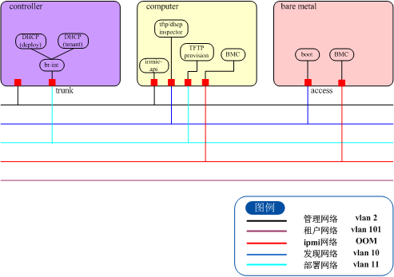

# Ironic开局文档

## 1. TECS环境搭建

### 1.1 使用daisy安装好计算节点和控制节点。

### 1.2 ironic节点安装

1. 首先选择一个专用的nova计算节点作为ironic节点。

2. 下载ironic升级bin文件到该节点的控制节点。

3. 下载ironic升级bin文件和nova的bin文件到ironic节点；

4. 对于安全加固环境，需要通过`sudo -i`，输入当前用户的密码切换到root用户。（如果没有切换用户，执行bin包会报错）

5. 修改或生成配置文件`/root/settings.conf`，将里面的IP替换成实际的IP，下面是一个模板文件，关于inspector可以参考后面章节。

   ```shell
   [default]
   # 控制节点管理网的IP
   control_node_ip=10.43.210.22
   # openstack project list看到的
   project_name=services
   [database]
   # 数据库IP
   ip_addr=10.43.210.22
   # 数据库端口号
   port=29998
   [ironic]
   # ironic 节点IP
   ironic_node_ip=10.43.210.23
   [inspector]
   # inspector DHCP服务监听网口
   dnsmasq_interface=eth0
   # inspector DHCP IP 范围
   dhcp_range=192.168.2.10,192.168.2.200
   ```

6. 先在控制节点上安装bin包，需要指定配置文件，如果没有指定，可以先执行一次bin，会在根目录下生成一个配置文件，修改参数再指定这个配置文件。 命令如：

   ```shell
   ./ironic-ocata-1.bin.bin /root/settings.conf control
   ```

7. 在计算节点上安装bin包，需要指定配置文件，如果没有指定，可以先执行一次bin，会在根目录下生成一个配置文件，修改参数再指定这个配置文件。 命令如：

   ```shell
   ./ironic-ocata-1.bin.bin /root/settings.conf compute
   ```
   注意，bin里默认是vlan的配置，ironic-conductor服务起不来，需要在vlan组网后，创建provision网络和clean网络，填写到ironic配置文件中后，重启ironic-conductor服务。详见2.2.2provision网络配置章节。如果需要改成flat组网，详见2.1flat网络配置章节，修改完配置文件同样需要重启ironic-conductor服务。

8. 在计算节点上安装修改nova代码的bin包（后续合入版本中，当前提供文件替换脚本）

   ```shell
   ./nova-script-1.bin	
   ```

   详细文档参考[O版本ironic及相关配置反合](http://wiki.zte.com.cn/pages/viewpage.action?pageId=41705673)

9. 在控制节点添加物理交换机的驱动配置（后续合入到版本中）

   ```shell
   #必须安装yum install -y git。
   #更新scp的python包；否则安装失败，也有可能是在重启服务的时候报scp错误。
   # cd /usr/lib/python2.7/site-packages/neutron/plugins/ml2/drivers/scp-0.10.2/
   # python setup.py install

   1、copy genericswitch到/usr/lib/python2.7/site-packages/neutron/plugins/ml2/drivers,cd /usr/lib/python2.7/site-packages/neutron/plugins/ml2/drivers/genericswitch，执行python setup.py install。
   2、cd /usr/lib/python2.7/site-packages/neutron/plugins/ml2/drivers/genericswitch/netmiko，执行python setup.py install。
   3、修改ml2_conf.ini。mechanism_drivers增加genericswitch
     vi /etc/neutron/plugins/ml2/ml2_conf.ini
     mechanism_drivers =openvswitch,genericswitch
   4、增加/etc/neutron/plugins/ml2/ml2_conf_genericswitch.ini，内容为物理交换机的信息：
   假设新增交换机厂家为 $vendor，型号为 $model，mac地址为$id，例如：
   [genericswitch:$id]
   device_type = netmiko_$vendor_$model
   username = root
   password = ossdbg1
   secret = calvin
   ip = 10.43.200.225
   注：
   	a、$id是交换机唯一的mac地址，要和实际传给ironic port的一致。
   	b、vendor和model根据实际的厂商填，需要neutron补充支持的完整列表。例如，中兴5920交换机的device_type填写netmiko_zte_5952。
   	c、需要新建的文件可能权限不对，需要chgrp neutron /etc/neutron/plugins/ml2/ml2_conf_genericswitch.ini
   5、编辑/usr/lib/systemd/system/neutron-server.service，增加启动参数
   	--config-file /etc/neutron/plugins/ml2/ml2_conf_genericswitch.ini
   6、systemctl daemon-reload
   7、systemctl restart neutron-*
   ```

   详细文档参考[neutron ml2插件合入](http://wiki.zte.com.cn/pages/viewpage.action?pageId=41704693)

10. 控制节点没有ironic命令行。

   计算节点需要从控制节点拷贝对应的keystone认证文件keystonerc_admin,  编辑keystonerc_admin,  在末尾增加exportIRONIC_API_VERSION="1.20"  例 :


```shell
#如果是admin租户
vi ~/keystonerc_admin
#在文件尾添加
export IRONIC_API_VERSION="1.20"
```

```shell
#回到根目录执行
source /root/keystonerc_admin
```

11. 以上修改配置文件的完成后，需要重启openstack的相关服务，主要是nova，neutron和ironic。

```shell
#控制节点 :
systemctl restart openstack-nova-*
systemctl restart neutron-*
计算节点 :
systemctl restart openstack-nova-*
systemctl restart neutron-*
systemctl restart openstack-ironic-inspector.service 
systemctl restart openstack-ironic-inspector-dnsmasq.service
systemctl restart openstack-ironic-api.service
#注:计算节点的 openstack-ironic-conductor.service 服务需要配置了provision 网络, clean网络信息之后才能正常启动
```

## 2. 组网

### 2.1 flat网络配置

1. 将控制节点的ovs口加入网桥中，将其填入neutron的配置文件，如下（这个是neutron的修改）：

   ```shell
   #在neutron配置文件/etc/neutron/plugins/ml2/ml2_conf.ini中，确保一下flat支持
   [ml2]
   type_drivers=flat,vlan
   [ml2_type_flat]
   flat_networks= *
   [ml2_type_vlan]部分
   network_vlan_ranges=physnet1
   #在/etc/neutron/plugins/ml2/openvswitch_agent.ini中，确保配置了网桥
   bridge_mappings = physnet1:br-data1
   ```
   ```shell
   #如果控制节点没有为ovs口配置网桥，按如下配置，假设ens160为ovs口
   ovs-vsctl add-br br-data1
   ovs-vsctl add-port br-data1 ens160
   ```

   完成后重启neutron服务`systemctl restart neutron-*`

2. 修改ironic的配置文件中关于网络的部分，或者添加flat网络的环境变量：

   ```shell
   #在/etc/ironic/ironic.conf中，确保一下flat支持
   enabled_network_interfaces = flat,noop,neutron
   default_network_interface = flat
   ```
   ```shell
   #或者在创建节点的时候指定network_interface
   ironic node-update $UUID replace network_interface=flat
   ```

3. 创建一个flat网络：

   这里注意租户id，以及网络类型选择flat。

   ```shell
   TENANT_ID=`openstack project list | awk '/admin/ {print $2}'`
   neutron net-create --tenant-id $TENANT_ID flatnet1 --shared --provider:network_type flat --provider:physical_network physnet1
   neutron subnet-create flatnet1 10.43.210.0/23 --name my_dhcp_test --ip-version=4 --gateway=10.43.210.1 --allocation-pool start=10.43.211.45,end=10.43.211.46 --enable-dhcp
   ```

4. 将这个flat网络填入ironic的配置文件中：

   ```shell
   NETUUID=`neutron net-list | awk '/flatnet1/ {if($4="flatnet1"){print $2}}'`
   #修改/etc/ironic/ironic.conf,注意实际环境中不能采用变量，得实际填UUID
   cleaning_network=$NETUUID
   provisioning_network=$NETUUID
   ```

   完成后重启ironic服务`systemctl restart openstack-ironic-*`

### 2.2 vlan网络配置

1. 将控制节点的ovs网口加入网桥中，将其填入neutron的配置文件，如下（这个是neutron的修改）：

   ```shell
   #在neutron配置文件/etc/neutron/plugins/ml2/ml2_conf.ini中，确保一下vlan支持
   [ml2]
   type_drivers=flat,vlan
   [ml2_type_vlan]部分
   #vlan情况必须配置可用的vlan范围，例如
   network_vlan_ranges=physnet1:100:2000
   #在/etc/neutron/plugins/ml2/openvswitch_agent.ini中，确保配置了网桥和物理网对应关系
   bridge_mappings = physnet1:br-data1
   ```
   ```shell
   #如果控制节点没有为ovs网口配置网桥，按如下配置，假设ens160为ovs网口
   ovs-vsctl add-br br-data1
   ovs-vsctl add-port br-data1 ens160
   ```

   完成后重启neutron服务`systemctl restart neutron-*`

2. 在计算节点，修改ironic的配置文件中关于网络的部分：

   ```shell
   #在/etc/ironic/ironic.conf中，确保一下flat支持
   enabled_network_interfaces = flat,noop,neutron
   default_network_interface = neutron
   ```

   方法二（不常用）：

   ```shell
   #或者在更新节点的时候指定network_interface
   ironic node-update $UUID replace network_interface=neutron
   ```

3. 创建一个provision网络，比如：

   这里注意租户id，以及网络类型选择vlan。

   ```shell
   # openstack project list看到的admin的id
   TENANT_ID=`openstack project list | awk '/admin/ {print $2}'`
   PROVISION_VLAN_ID=11

   neutron net-create --tenant-id $TENANT_ID provision --provider:network_type vlan --provider:physical_network physnet_vlan --provider:segmentation $PROVISION_VLAN_ID

   neutron subnet-create provision 192.168.6.0/24 --name deploy_dhcp --ip-version=4 --gateway=192.168.6.1 --allocation-pool   start=192.168.6.10,end=192.168.6.200 --enable-dhcp
   ```

4. 将这个provision网络填入ironic的配置文件中，比如：

   ```shell
   NETUUID=`neutron net-list | awk '/provision/ {if($4="provision"){print $2}}'`
   ```

   ```shell
   #修改/etc/ironic/ironic.conf,注意实际环境中不能采用变量，得实际填UUID
   cleaning_network=$NETUUID
   provisioning_network=$NETUUID
   ```

   完成后重启ironic服务`systemctl restart openstack-ironic-*`

   vlan模型组网如下图所示，这里，裸机的boot口vlan是动态在发现，部署和租户网络之间切换的。



#### 2.2.1 inspector网络配置

inspector网络是用来做主机发现的，inspector主要提供DHCP和TFTP服务。由于inspector网络会响应所有DHCP请求，所以该网络由管理员创建，单独管理，创建后不再修改。

在前面安装ironic bin文件时，填写了`dnsmasq_interface`网口，这个网口会用来做主机发现的DHCP口和TFTP口。

管理人员在ironic节点做如下配置：

1. 假设inspector是vlan 10,  dnsmasq_interface 是eth1 （对应图 2- 1中计算节点的第二个网口）;
2. 修改`/etc/sysconfig/network-scripts/ifcfg-eth1`，给eth1配置静态ip;
3. 如果ironic节点是物理机连接交换机，修改eth1对应交换机端口的vlan id为10 (access模式)。
4. 修改`/tftpboot/pxelinux.cfg/default`中`ipa-inspection-callback-url=http://$ip:5050/v1/continue`的$ip为上面给eth1配置的静态ip。

#### 2.2.2 provision网络配置

provision网络是用来安装裸机操作系统的，主要在部署时使用，通过neutron创建。provision网络应该是admin租户下的一个共享网络。

1. 首先要经过上面2.2 vlan网络配置中，创建网络的步骤。

2. 假设ironic provision 的TFTP 口是eth2， 则配置eth2的IP地址。

```shell
# 修改/etc/sysconfig/network-scripts/ifcfg-eth2
```

3. 如果是物理机，配置eth2 对应交换机端口的vlan id为11(provision vlan id)，这里采用access模式。
4. 创建完provision网络之后。在计算节点，把provison的net id和tftp网口的IP地址（示例中的192.168.6.2），写到ironic配置文件`/etc/ironic/ironic.conf`中:

```shell
[DEFAULT]
enabled_network_interfaces = flat,noop,neutron
default_network_interface = neutron
my_ip=192.168.6.2
[neutron]
# provision net 的UUID
cleaning_network = 17036dcf-d256-4ac5-916d-8849334ad977
provisioning_network = 17036dcf-d256-4ac5-916d-8849334ad977
[conductor]
# 这里是eth2 的IP
api_url=http://$my_ip:6385
[pxe]
# 这里是eth2 的IP
tftp_server = $my_ip
```
```shell
#重启ironic服务
systemctl restart openstack-ironic-*
```

#### 2.2.3 tenant网络配置

租户网络的配置和provision网络相同，参考：[2.2.2小节](####2.2.2 provision网络配置)，**但需要保证，租户网络的vlan id和inspector, provision使用不同的vlan id，并且需要创建子网。**

## 3. 裸机配置

1. 管理人员明确inspector网络使用的vlan id；
2. 施工人员修改裸机物理网口的对应交换机端口的vlan id，将裸机所有网口接入到inspector网络中（BMC网口走带外网络）；
3. 施工人员开启tor交换机的LLDP功能（RXTX都需要打开，有些交换机需要重启端口生效）；
4. 施工人员手工配置裸机的raid；
5. 施工人员手工开启所有网口pxe功能。

## 4. 裸机部署

详细的使用说明以后可以参见：http://wiki.zte.com.cn/display/TECS/ironic

注意：vmware环境需要在分布式交换机编辑设置的安全选项中接受伪传输，否则dhcp的报文无法到达裸机。

### 4.1 命令行操作

1、控制节点不再安装ironic命令行，所有ironic命令都在计算节点操作。
2、计算节点配置环境变量export IRONIC_API_VERSION="1.20"
3、计算节点上执行命令，需要先source keystonerc_admin。如果没有keystonerc_admin，从控制节点/root/目录拷贝。
4、示例脚本见tools。
5、首先注册节点。注册完成后ironic节点是enroll状态。
6、进行主机发现流程。(需要保证inspect和inspect-dnsmasq服务处于正常状态。如果是flat网络，则注意inspect前需要把其他的dnsmasq进程关闭)

```shell
#首先将节点切换为manage状态
ironic node-set-provision-state $UUID manage
#然后执行inspect操作，期间可以查看ironic node节点状态为inspect
ironic node-set-provision-state $UUID inspect
#inspect成功后会再次进入manageable状态，切换为provide可以使ironic进入available状态
ironic node-set-provision-state $UUID provide
```

### 4.2 界面操作

上海调试中，后续补充界面截图和操作流程。